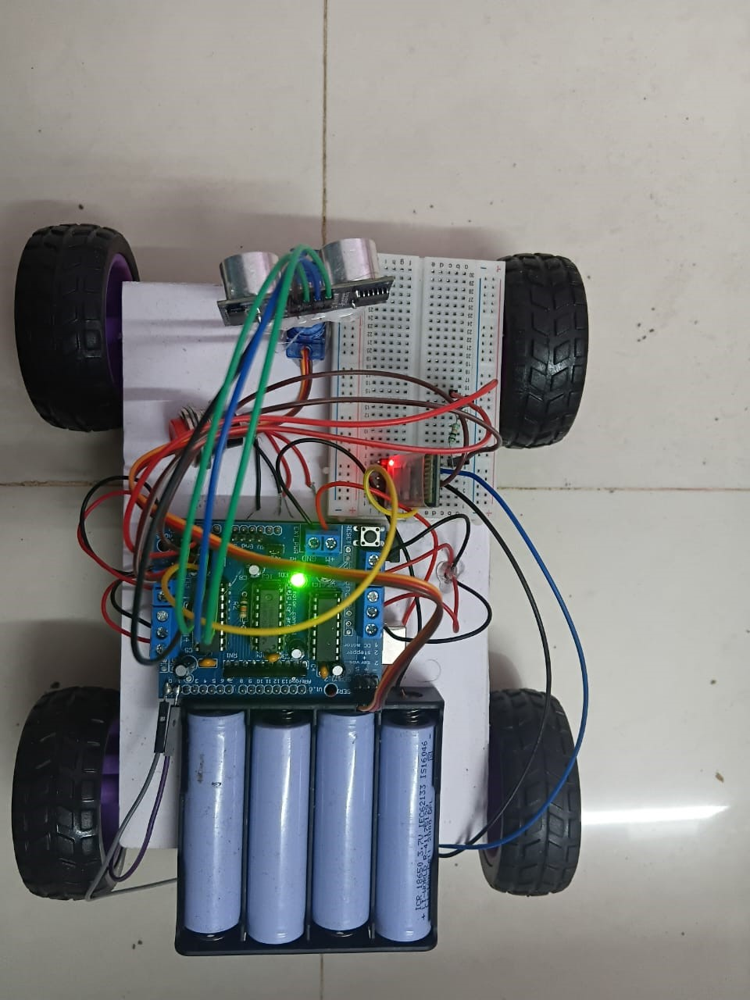

# Smart-Obstacle-Avoidance-Robot
 Arduino-based Obstacle Avoiding Robot using ultrasonic sensors and motor driver for autonomous navigation and collision avoidance.
Arduino Obstacle Avoiding Robot
This project is an autonomous obstacle-avoiding robot built using Arduino Uno, an ultrasonic sensor, a motor driver module, and DC motors. The robot continuously detects obstacles in its path and automatically changes direction to avoid collisions. The project demonstrates the fundamentals of robotics, sensor integration, embedded systems, and autonomous navigation.

# Smart Obstacle Avoidance Robot

## Project Image

## Description

Arduino-based obstacle avoiding robot using ultrasonic sensors and motor driver for autonomous navigation and collision avoidance.

## Components Used
- Arduino Uno
- HC-SR04 Ultrasonic Sensor
- Servo Motor
- L293D Motor Driver
- DC Motors
- 18650 Battery Pack

## Features
- Obstacle Detection
- Autonomous Navigation
- Collision Avoidance
- Servo-Based Scanning

## Technologies Used
- Arduino IDE
- Embedded C/C++
- Robotics
- Sensor Interfacing
